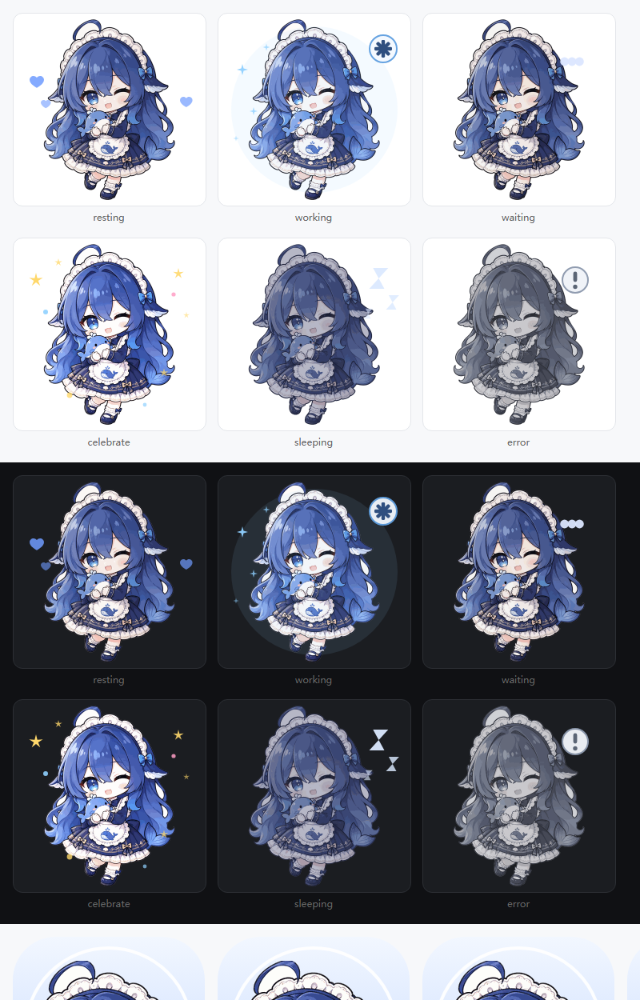
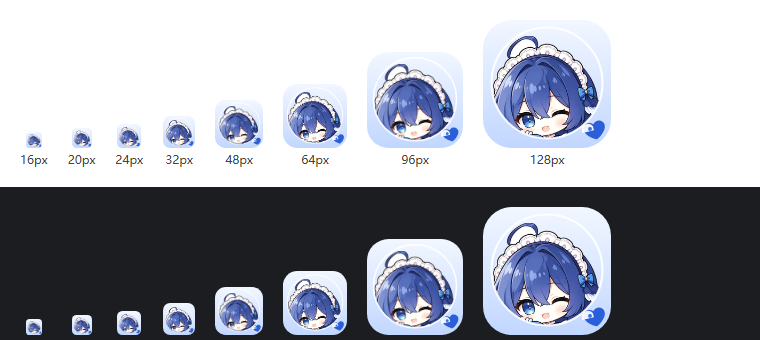

# Whale Maid Companion

[](https://github.com/yangyiqun747/dsh-plugin-whale-maid/actions/workflows/checks.yml)
[](LICENSE)

**A chibi whale-maid companion who works, waits, celebrates and naps alongside you.**



*All six states, rendered by a real browser in both themes. Regenerate with `python artwork/tools/review-states.py`.*

一只住在 DSH 窗口里的 Q 版鲸鱼小管家：陪你工作、等你确认、为你欢呼，也陪你打个盹。

This plugin keeps the full feature set of its upstream project
[`dsh-plugin-whale-pet`](https://github.com/Yifffan/dsh-plugin-whale-pet) (MIT code, v0.2.9)
and replaces the character: the whale stickers are gone, and every state is drawn from an
owner-supplied chibi whale-maid illustration with its own transparent cut-out, per-state
recolouring and small vector effects.

## Features

- Drag, resize, hide, and restore the companion inside the DSH window.
- Choose **All sessions** or **Current session**, with a working-session count for ordinary main sessions.
- Six states: resting, working, waiting, celebrating, sleeping, and error.
- A custom plugin-manager icon, built from the same artwork and legible at 16 px.
- English and Chinese text, light and dark settings menus, and reduced-motion support.
- Separate normal completion from cancellation and failure; a falling working count or a green unread indicator alone does not mean success.

This is an in-window plugin, not a separate operating-system desktop overlay.

## The six states

| State | Look |
| --- | --- |
| resting | the character as drawn, with soft floating hearts |
| working | slightly warmer and brighter, with small progress sparkles |
| waiting | a thought bubble appears above the head |
| celebrate | brighter still, with stars and confetti around her |
| sleeping | dimmed and blue-shifted, with drifting "Z" marks |
| error | desaturated to grey, with a warning badge |



*The plugin-manager icon at the sizes DSH actually draws it.*

Each state ships as one SVG that embeds the character raster plus its own vector effects.
The artwork is generated from the source illustration by the scripts in `artwork/`, so the
whole set can be regenerated after the illustration changes:

```sh
python artwork/tools/make-assets.py      # writes assets/*.svg and assets/icon.svg
python artwork/tools/review-states.py    # writes artwork/build/states-with-effects.png
```

## Install

### 1. From a local package (recommended for this build)

Build or download `dsh-plugin-whale-maid-<version>.tgz`, then enter its **absolute path** in
DSH's plugin installation interface, for example:

```text
<wherever you saved it>\dsh-plugin-whale-maid-1.0.0.tgz
```

The released 1.0.0 package is 747,460 bytes with SHA-256
`8a9a71681a14af84a0444fc58655996f9da66e727d85f996defc62a3b55a24f7`. Run
`npm pack` in this directory to rebuild a byte-identical archive.

### 2. From a checkout

Enter the absolute path of this directory in the same interface. The package carries
prebuilt `lib/` output, so no build step runs on install.

After an update that changes Host or client modules, wait for running tasks to finish, fully
quit DSH, and reopen it. Closing a window may not quit the application.

The plugin never edits your profile by itself. It inserts exactly one row (entry id
`whale-maid`) through its `cordis.patch.yml`.

## Usage

- **Click** the companion to say hello; **drag** her to reposition.
- **Right-click** to change session scope, size, animation, and nap timing.
- Use the restore button to bring back a hidden companion.
- Global scope covers ordinary main sessions on the currently connected Host—not multiple devices or Hosts.
- Waiting for user input has higher display priority. Brief completion notices are not queued for later replay.

## Development

Use Node.js 22 or newer. The build needs `esbuild` and `zod@4.4.3` as development
dependencies (declare them locally, for example with `pnpm install`); nothing is installed
or downloaded at plugin install time.

```sh
node tools/bridge-build.mjs   # regenerate lib/remote.js + lib/index.js
node tools/build.mjs          # regenerate lib/client.js + offline preview
node --test "tests/*.test.mjs"
```

`tools/check-glyphs.mjs` reports any bubble phrase that the embedded font subset cannot
draw; the shipped Chinese dictionary is kept inside that subset so the bubble font never
falls back mid-sentence.

The build validates every state SVG: no scripting, no remote reference, `<image>` only with
an inline PNG payload, and a size ceiling. Open `preview/index.html` directly in a browser
for an offline preview that never connects to DSH or a model.

## Privacy and runtime boundaries

- Does not modify DSH itself, send model messages, add model inference calls, or act on approvals for you.
- Uses DSH's existing authenticated connection. No additional listening port, telemetry, or runtime font/CDN requests.
- The completion bridge projects only session identity and turn-boundary metadata—not chat content.
- Preferences stay in client-local storage.

## Licensing

- **Code:** [MIT](LICENSE), inherited from the upstream project. The upstream repository,
  its build tooling, its state machine and its wording are the work of the upstream authors.
- **Character artwork:** supplied by this package's owner. See the
  [notice](NOTICE) and [character asset notes](ASSETS-LICENSE.md); it is not covered by the
  MIT code license.
- **Bubble fonts:** unchanged upstream subsets, see [font licenses](FONT-LICENSES.md).

This is a personal project, not an official DeepSeek product. It does not represent
DeepSeek's official views or endorsement, and it is not affiliated with the upstream
`dsh-plugin-whale-pet` project beyond the MIT-licensed code it builds on.
